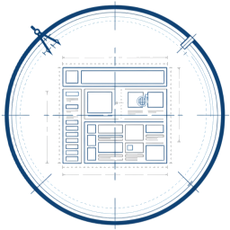

<!--_____________________     _                       _       _
 / \                     \   | |_ ___ _ __ ___  _ __ | | __ _| |_ ___
|   |                    |   | __/ _ \ '_ ` _ \| '_ \| |/ _` | __/ _ \
 \_ |                    |   | ||  __/ | | | | | |_) | | (_| | ||  __/
    |                    |    \__\___|_| |_| |_| .__/|_|\__,_|\__\___|
    |                    |                     |_|
    |                    |
    |  __________________|__   project cardfx
    |  \                    \
    |  /                    /
    \_/____________________/
-->
<table align=center>
 <tr><td align=center width=400>
   <b>cardfx</b> 
   card effects
  </td></tr>
    <tr><td align=center>
    
    </td></tr>
 <tr><td align=left>
    
    <b>cardfx</b>
     
    This is a template for creating a new web app project.
      
    You can replace all of the &#123;&#123;vars&#125;&#125; to customize it.
      
    Consider using the github
    <a href="https://github.com/rg3h/projectMaker">projectMaker</a> which
     will help you do this.
    
     
     
   <!-- use this for your project ----------------------------------------------------------
    <a href="https://github.com/{{githubUserid}/cardfx/raw/refs/heads/main/cardfx.zip">
      
      <a href="https://rg3h.github.io/cardfx/index.html">
      
     ---------------------------------------------------------------------------------- -->
     <!-- remove these two links below which are just for the template's README.md -->
    
    
  </td></tr>
</table>
